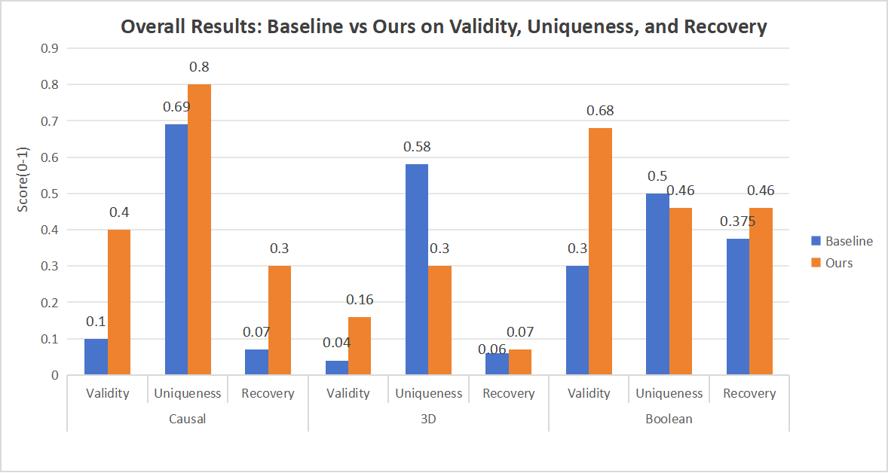

# HypoSpace – Structured Decoding & Coverage-Greedy Selection
**Authors:** Yufan LIU, Zhe LIU, Siwei CHEN, Yuchun KE  
**Course:** EEC4300 Machine Learning:Models and Applications

This repository presents our implementation for the three HypoSpace tasks—**Causal Graphs**, **3D Voxel Reconstruction**, and **Boolean Genetic Interactions**—together with scripts for dataset generation, evaluation, and optional lightweight fine-tuning. We treat an LLM as a **hypothesis-set sampler** and raise the core creativity metrics—**Validity (V)**, **Uniqueness (U)**, and **Recovery (R)**—via four components:

1) format-strict **structured decoding** (pure JSON schemas)  
2) **canonicalization + deterministic validation**  
3) **diversity-aware sampling** with de-duplication  
4) a **coverage-greedy selector** that maximizes marginal coverage

---

## 1. Results 

All values are reported in [0,1].

| Domain   | Baseline V/U/R     | Ours V/U/R         | Δ (↑)                |
|---------:|:-------------------:|:-------------------:|:---------------------:|
| Causal   | 0.10 / 0.69 / 0.07  | 0.40 / 0.80 / 0.30  | +0.30 / +0.11 / +0.23 |
| 3D       | 0.04 / 0.58 / 0.06  | 0.16 / 0.30 / 0.07  | +0.12 / -0.28 / +0.01 |
| Boolean  | 0.30 / 0.50 / 0.38  | 0.68 / 0.46 / 0.46  | +0.38 / -0.04 / +0.08 |
| **Avg.** | **0.15 / 0.59 / 0.17** | **0.41 / 0.52 / 0.28** | **+0.26 / -0.07 / +0.11** |

**Interpretation.**  
Our pipeline yields consistent gains on **Causal** (Validity +0.30, Recovery +0.23; parse success ≈ **1.00**). On **3D**, Validity increases (+0.12) and Recovery improves slightly (+0.01), with Uniqueness decreasing (−0.28) under stricter formatting, validation, and de-duplication; parse success rises from **0.81** to **0.99**. On **Boolean**, Validity improves substantially (+0.38), Recovery improves moderately (+0.08), while Uniqueness is slightly lower than the baseline (−0.04).

  
  

---

## 2. Method (Overview)

**Structured decoding.** Prompts enforce **pure JSON** matching a task-specific schema (edges for causal graphs, voxel lists for 3D, normalized Boolean forms or truth tables). Non-conforming outputs are rejected and retried.

**Canonicalization & validation.**  
- *Causal:* canonical DAG classes via node relabeling; verify against interventions/observations.  
- *3D:* sorted voxel coordinates with mask consistency checks.  
- *Boolean:* CNF/DNF (or truth tables) evaluated against observed assignments.  
This step lifts **Validity** and enables exact de-duplication to improve **Uniqueness**.

**Diversity-aware sampling.** We draw \(m\) raw samples over a small temperature/top-p grid, parse, canonicalize, and de-duplicate to avoid superficial variants.

**Coverage-greedy selection.** From the validated pool we select up to \(K\) hypotheses by **marginal coverage gain** (new equivalence classes / voxels / Boolean models), directly targeting **Recovery**.

**QLoRA fine-tuning (clarified).**  
We fine-tune **Qwen2.5-14B-Instruct** under the QLoRA framework:  
- **4-bit NF4 quantization on model weights** (via `bitsandbytes`); computation in **bf16**.  
- **LoRA configuration:** `r=64`, `alpha=128`, `dropout=0.05`, with target modules  
  `["q_proj","k_proj","v_proj","o_proj","gate_proj","up_proj","down_proj"]`.  
- **Optimizer:** `paged_adamw_8bit` (the *8-bit refers to optimizer states*, not weight quantization).  
- **Training schedule:** `max_steps=700`, `warmup_steps=50`, gradient accumulation `GA=4`.  
- **Validation:** evaluate every 100 steps; save the best checkpoint.  
- **Deployment:** after training, merge adapters (`merge_and_unload`) to obtain a standalone model.

---

## 3. Repository Layout

~~~
.
├── Causal/
│   ├── run_causal_benchmark.py
│   ├── generate_causal_dataset.py
│   ├── generate_causal_dataset_for_large.py
│   ├── config/
│   │   └── config_LocalQwen.yaml
│   ├── modules/
│   │   ├── llm_interface.py
│   │   └── models.py
│   ├── Finetune_causal/
│   │   └── Causal_finetune_QLoRA.py
│   └── merge_weight/
│       └── merge_weight_Causal.py
│
├── 3d/
│   ├── run_3d_benchmark.py
│   ├── generate_3d_dataset_complete.py
│   ├── config/
│   │   └── config_LocalQwen.yaml
│   ├── modules/
│   │   ├── llm_interface.py
│   │   └── models.py
│   └── 3dFinetune/
│       └── 3d_finetune.py
│
├── Boolean/
│   ├── boolean_benchmark.py
│   ├── boolean_dataset.py
│   ├── config/
│   │   └── config_LocalQwen.yaml
│   ├── modules/
│   │   ├── llm_interface.py
│   │   └── models.py
│   ├── BooleanFinetune/
│   │   └── Fine-tuning.py
│   └── BooleanMergeWeight/
│       └── merge_weight_2-Copy1.py
│
└── Figs/
    └── overall_bars.png
~~~

---

## 4. Environment & Installation

Tested on Python 3.10+.

~~~bash
# Create a clean environment
conda create -n hypospace python=3.10 -y
conda activate hypospace

# Core dependencies
pip install -U torch transformers peft bitsandbytes datasets numpy scipy sympy networkx pyyaml requests
~~~

> Note: weights are **4-bit NF4** quantized (via `bitsandbytes`), the optimizer is **paged_adamw_8bit**, and computation runs in **bf16**.

---

## 5. Data Generation

### 5.1 Causal
~~~bash
# Small graphs (n=3)
python Causal/generate_causal_dataset.py \
  --nodes 3 --seed 33550336 --output datasets/causal_n3.json

# Larger graphs with filters
python Causal/generate_causal_dataset_for_large.py \
  --nodes 5 \
  --n-observations 5 --fixed \
  --n-observation-sets 1000 \
  --seed 42 \
  --output datasets/causal_n5_fixed5.json
~~~

### 5.2 3D
~~~bash
python 3d/generate_3d_dataset_complete.py \
  --grid-size 3 --max-blocks 3 --max-height 3 \
  --output datasets/3d_complete.json \
  --seed 42
~~~

### 5.3 Boolean
The complete Boolean datasets are not committed by default. Either copy them into the repo or pass an absolute path:

**Option A (place under repo):**
~~~bash
mkdir -p Boolean/dataset
# copy your JSON files to Boolean/dataset/
~~~

**Option B (use absolute path):**
~~~bash
# later in §6.3, set --dataset /abs/path/to/boolean_datasets_complete_*.json
~~~

---

## 6. Running Benchmarks

### 6.1 Causal
~~~bash
python Causal/run_causal_benchmark.py \
  --dataset datasets/causal_n3.json \
  --config Causal/config/your_config.yaml \
  --n-samples 30 --query-multiplier 1.0 \
  --seed 33550336 \
  --checkpoint-dir checkpoints/causal \
  --output results/causal/causal_n3_yourmodel.json
# Useful filters: --n-observations-filter "2,3" or "2-5" ; --gt-filter "10-16"
~~~

### 6.2 3D
~~~bash
python 3d/run_3d_benchmark.py \
  --dataset datasets/3d_complete.json \
  --config 3d/config/your_config.yaml \
  --n-samples 30 --query-multiplier 1.0 \
  --seed 42 \
  --checkpoint-dir checkpoints/3d \
  --output results/3d/three_d_complete_yourmodel.json
~~~

### 6.3 Boolean
~~~bash
python Boolean/boolean_benchmark.py \
  --dataset Boolean/dataset/boolean_datasets_complete_*.json \
  --config Boolean/config/your_config.yaml \
  --n-samples 30 --query-multiplier 1.0 \
  --seed 42
# If you used an absolute dataset path, replace the --dataset argument accordingly.
~~~

---

## 7. Parse Success & Token Usage (Summary)

This section summarises stability and approximate token cost.

| Domain | Setup     | Parse Success (Mean) | Avg tokens / sample | Total tokens |
|:------:|:---------:|:--------------------:|:-------------------:|:------------:|
| Causal | Baseline  | 0.93                 | 2,528.20            | 25,282       |
| Causal | Ours      | 1.00                 | 6,148.80            | 61,488       |
| 3D     | Baseline  | 0.81                 | 133,615.90          | 1,336,159    |
| 3D     | Ours      | 0.99                 | 50,147.60           | 401,181      |
| Boolean| Baseline  | —                    | 709.40              | 7,094        |
| Boolean| Ours      | —                    | 936.2                |9,362         |

**Notes.**  
- On **3D**, parse success increases from **0.81** to **0.99**, while average tokens per sample drop from ~133.6k to ~50.1k due to stricter schemas and de-duplication.  
- On **Causal**, higher token usage on “Ours” reflects deeper candidate pools for coverage-greedy selection.  
- For **Boolean**, baseline token usage averages **~936.2** tokens per sample (total **9,362**).
---

## 8. Reproducibility

- **Seeds:** Causal 33550336; 3D 42; Boolean 42  
- **Model:** Qwen2.5-14B-Instruct with QLoRA (4-bit NF4 on weights, bf16 compute, paged_adamw_8bit optimizer)  
- **LoRA:** `r=64, alpha=128, dropout=0.05`, target modules as listed in §2  
- **Dataset generators & flags:** §5  
- **Exact commands:** §6  
- **Artifacts:** JSON dumps under `results/<domain>/` and plots under `figures/`

---

## 9. Security & Ethics

- Never commit API keys or private endpoints; rely on environment variables or ignored local config files.  
- Review commit history for accidental secrets before making the repository public.  
- All models and trademarks are the property of their respective owners.

---

## 10. Acknowledgements

This work was completed as part of the **EEC4300 Machine Learning: Models and Applications** course. We follow the HypoSpace task(https://github.com/CTT-Pavilion/_HypoSpace) formulation and extend the official runners with structured decoding, validation, and coverage-oriented selection.

